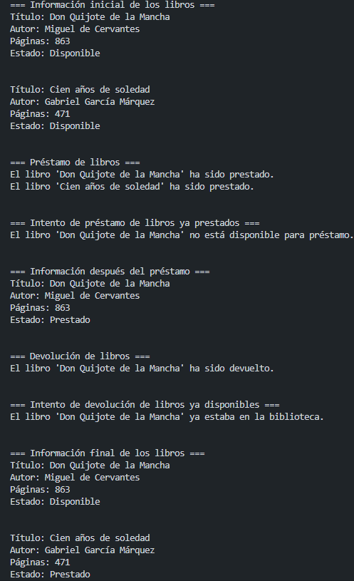
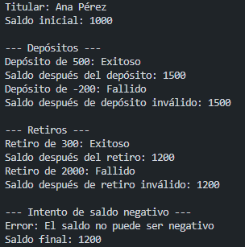

# Proyectos de Programación Orientada a Objetos en Python (POO)

Este repositorio contiene tres ejercicios prácticos que demuestran la aplicación de conceptos fundamentales de POO en Python:

1. **Taller 1 – Clases y Objetos:** Implementación de la clase `Libro` con gestión de préstamos.
2. **Taller 2 – Encapsulación:** Implementación de la clase `CuentaBancaria` con atributos privados y propiedades.
3. **Reto final – Sistema de Préstamos de Equipos:** Aplicación completa con menú interactivo usando diccionarios, listas y tuplas.

A continuación se detalla el diseño, ejemplos de ejecución y una reflexión personal sobre cada uno.

---

## Taller 1: Clase `Libro`

### Explicación del diseño de clases

La clase `Libro` modela un libro en una biblioteca. Sus atributos son:

- `titulo`, `autor`, `paginas` (públicos)
- `disponible` (booleano, inicializado a `True`)

Los métodos implementados son:

- `__init__`: constructor que inicializa los atributos.
- `prestar()`: cambia `disponible` a `False` si el libro estaba disponible; en caso contrario, informa que ya está prestado.
- `devolver()`: cambia `disponible` a `True` si el libro estaba prestado; si ya estaba disponible, lo indica.
- `informacion()`: devuelve una cadena con todos los datos del libro, incluyendo su estado actual.

No se utilizó encapsulación en este taller (los atributos son públicos), ya que el objetivo era entender la relación clase‑objeto y los métodos básicos.

### Ejemplos de ejecución y capturas sugeridas

Ejemplo de salida esperada (sin captura, solo texto representativo):

=== Información inicial de los libros ===
Título: Don Quijote de la Mancha
Autor: Miguel de Cervantes
Páginas: 863
Estado: Disponible

Título: Cien años de soledad
Autor: Gabriel García Márquez
Páginas: 471
Estado: Disponible

=== Préstamo de libros ===
El libro 'Don Quijote de la Mancha' ha sido prestado.
El libro 'Cien años de soledad' ha sido prestado.

=== Intento de préstamo de libros ya prestados ===
El libro 'Don Quijote de la Mancha' no está disponible para préstamo.

=== Devolución de libros ===
El libro 'Don Quijote de la Mancha' ha sido devuelto.

=== Intento de devolución de libros ya disponibles ===
El libro 'Don Quijote de la Mancha' ya estaba en la biblioteca.

## Captura

### Reflexión personal

*Este taller me permitió entender la diferencia entre una clase (el plano) y los objetos (instancias concretas). Aprendí a usar el método constructor `__init__` y el parámetro `self`. El mayor reto fue comprender que cada objeto mantiene su propio estado independiente, de modo que modificar un libro no afecta al otro. También practiqué la lógica condicional dentro de los métodos para validar acciones como préstamo y devolución. Me pareció fundamental para sentar las bases de la POO.*

---

## Taller 2: Clase `CuentaBancaria` (Encapsulación)

### Explicación del diseño de clases y encapsulación

La clase `CuentaBancaria` implementa encapsulación mediante:

- **Atributos privados** (por convención con un guion bajo): `_titular` y `_saldo`.
- **Propiedades (`@property`)** para controlar el acceso:
  - `titular`: solo lectura (sin setter).
  - `saldo`: lectura y escritura, pero con validación: no se puede establecer un valor negativo. Si se intenta, se lanza `ValueError` con el mensaje "El saldo no puede ser negativo".
- **Métodos de negocio:**
  - `depositar(cantidad)`: solo si `cantidad > 0`, incrementa el saldo y retorna `True`; en caso contrario retorna `False`.
  - `retirar(cantidad)`: solo si `cantidad > 0` y hay saldo suficiente, disminuye el saldo y retorna `True`; en caso contrario retorna `False`.

El diseño protege los datos internos y asegura que nunca se pueda tener un saldo inválido.

### Ejemplos de ejecución y capturas sugeridas

Ejemplo de salida esperada (sin captura, solo texto representativo):

Ejemplo de salida esperada:
Titular: Ana Pérez
Saldo inicial: 1000

--- Depósitos ---
Depósito de 500: Exitoso
Saldo después del depósito: 1500
Depósito de -200: Fallido
Saldo después de depósito inválido: 1500

--- Retiros ---
Retiro de 300: Exitoso
Saldo después del retiro: 1200
Retiro de 2000: Fallido
Saldo después de retiro inválido: 1200

--- Intento de saldo negativo ---
Error: El saldo no puede ser negativo
Saldo final: 1200

## Captura

### Reflexión personal

*Este taller me enseñó la importancia de la encapsulación para proteger la integridad de los datos. Aprendí a usar propiedades (`@property` y `@setter`) para añadir lógica de validación sin perder la sintaxis natural de los atributos. El reto principal fue entender la diferencia entre atributo privado (`_saldo`) y la propiedad (`saldo`), y cómo el setter permite controlar la asignación. También comprendí que los métodos `depositar` y `retirar` actúan como una interfaz pública que mantiene la consistencia interna. Me gustó poder lanzar excepciones (`ValueError`) para indicar errores de manera clara.*

---

